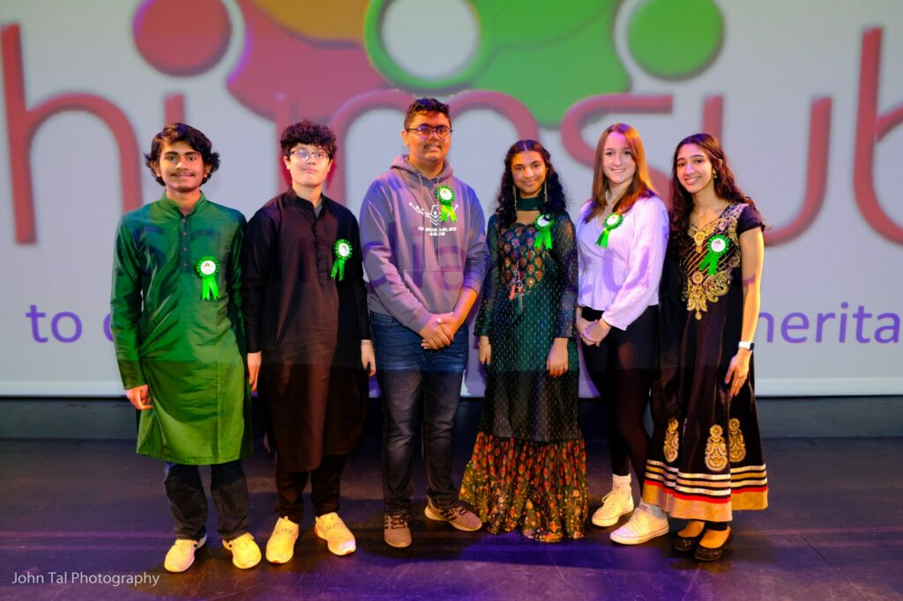

import YACard from '../components/YA-Card.astro';

# Youth Ambassador
A key focus area for Hum Sub in recent years has been Youth Leadership. This year, we are evolving our Youth Ambassador (YA) Program to a two-year internship, open to 9th and 10th graders. The goal is to provide a platform for growing young minds for community engagement to promote Indian culture and heritage in the Triangle area and beyond, as well as enhance their personal/professional development skills by engaging them in the planning, management and decision-making processes. The broad vision here is to bring in new energy and knowledge to Hum Sub's mission and vision, as well as contribute to positive youth development at an early age and help youth grow into engaged and responsible leaders in the future.

Those selected for this program should have had some volunteering experience at Hum Sub events in the past years or have volunteering experience with other local organizations. In keeping with our efforts to be diverse and inclusive, we will also open up the program to youth of non-Indian origin to serve as Youth Ambassadors.

## Benefits of becoming a Youth Ambassador:

- Develop individual competencies and leadership skills
- Develop time management skills
- Develop program planning, management and organizational skills
- Build positive self-identify and confidence through meaningful contribution to the local community
- Increase ability to be self-reflective and think critically about their experience
- Achieve recognition for community service and engagement

Hum Sub will involve YAs in various Hum Sub activities planned throughout the year. The goal here is to provide high-schoolers with a wide array of opportunities to experience and contribute to real-world program planning, decision making, program management and execution (on the event day) and help them develop key leadership skills.

Specifically, some examples of YA engagement include the following:

1. Program planning
2. Social media, publicity, and marketing
3. Program management
4. Program evaluation and documentation
5. Networking and relationship-building with other local organizations

## Youth Ambassadors (2024-2025)

    <YACard name="Sonia Daptardar" imagePath="/src/assets/ya/Sonia-Daptardar.jpeg" />
    <YACard name="Ishita Bafna" imagePath="/src/assets/ya/Ishita-Bafna.jpg" />
    <YACard name="Rishi Sankaran" imagePath="/src/assets/ya/rishi-sankaran.jpeg" />
    <YACard name="Apaarpreet Bajaj" imagePath="/src/assets/ya/Apaarpreet-Bajaj.jpeg" />
    <YACard name="Sanvi Pawar" imagePath="/src/assets/ya/Sanvi-Pawar.jpg" />
    <YACard name="Tanmayi Panasa" imagePath="/src/assets/ya/tanmayi-panasa.jpg" />
    <YACard name="Madhu Shri Gupta" imagePath="/src/assets/ya/madhu-shri-gupta.jpeg" />

